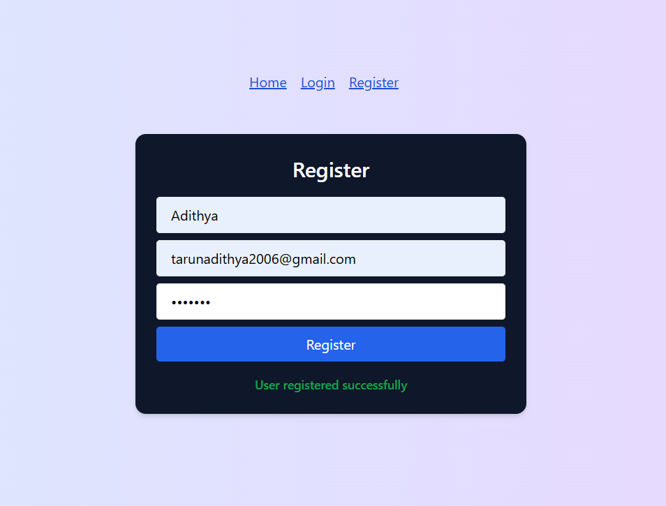

# LMS Authentication System

A simple and responsive **Login/Register** interface built with:

- React + TypeScript  
- Tailwind CSS  
- React Hook Form  
- React Router DOM  
- Axios (for API calls)  
- Vite (for development)  

---

##  Project Structure

```
client/
│
├── public/              # Static files
├── src/
│   ├── api/             # Axios API handlers
│   │   └── auth.ts
│   ├── components/      # React components
│   │   ├── Login.tsx
│   │   └── Register.tsx
│   ├── App.tsx          # Routing & layout
│   ├── main.tsx         # React app entry point
│   └── index.css        # Tailwind base styles
├── package.json
├── tailwind.config.js
└── tsconfig.json
```

---

##  Getting Started

### 1. Clone the repo

```
cd lms-auth-system/client
```

### 2. Install dependencies

```
npm install
```

### 3. Run the project

```
npm run dev
```

 Open browser:  
 `http://localhost:5173`

---

##  Features

-  Login & Register forms with validation  
- Email format check using regex  
-  Inline error messages on invalid input  
-  Beautiful Tailwind CSS UI  
-  Page routing using React Router  
-  Clean modular structure  

---

##  Dependencies

- `react`  
- `react-router-dom`  
- `react-hook-form`  
- `axios`  
- `tailwindcss`  
- `vite`  
- `typescript`  

---

##  Screenshots

###  Register Page



###  Login Page

![Login Page] (Screenshot 2025-07-04 171913.png)

> 💡 _You can take your own screenshots and place them inside a `/screenshots` folder._

---

## 🛠️ Customization

You can enhance the project by:

- 🔐 Integrating real backend authentication (JWT / Sessions)  
- 🔑 Adding strong password & confirm password fields  
- 🌈 Improving UI with animations or component libraries  
- 📫 Adding Forgot Password / Email Verification flow  

---
